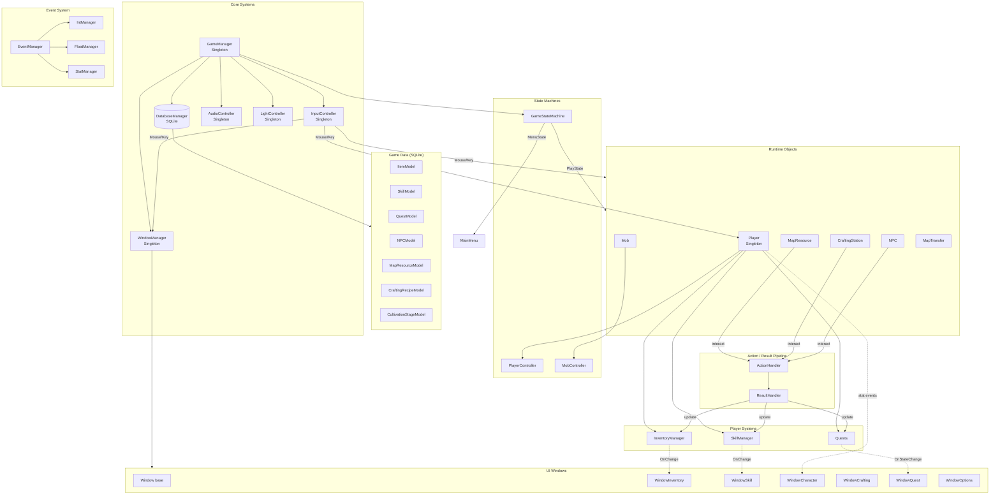
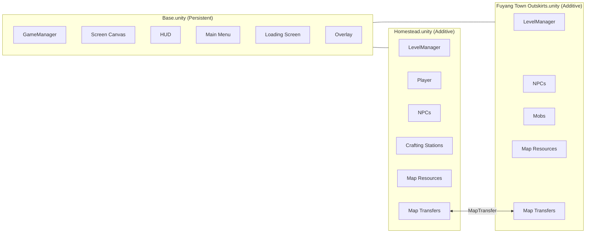

# MabWorld Architecture

## Class Diagram

```mermaid
classDiagram
    direction TB

    %% ============================================================
    %% CORE SINGLETONS
    %% ============================================================

    class GameManager {
        <<Singleton>>
        +InputController inputController
        +LightController lightController
        +AudioController audioController
        +WindowManager windowManager
        +DatabaseManager Database
        +GameStateMachine gameStateMachine
        +Canvas screenCanvas
        +Canvas worldCanvas
        +LoadAsset~T~(key) T
        +ChangeScene(name, pointID)
        +SaveGame()
        +LoadGame()
    }

    class InputController {
        <<Singleton>>
        +Dictionary~KeyCode, InputSettings~ buttonKeybinds
        -UI_DialogueBox activeDialogueBox
        -UI_Item activeItem
        +Update()
        +OpenWindow~T~()
    }

    class AudioController {
        <<Singleton>>
        +AudioSource globalAudio
        -AudioSource playerAudio
        +PlayGatherResultSFX(bool)
        +PlayLevelUpSFX()
    }

    class LightController {
        <<Singleton>>
        -Light2D globalLight
        -Clock() IEnumerator
        -BeginLightingCycle(duration, color) IEnumerator
    }

    class LevelManager {
        <<Singleton>>
        +Canvas worldCanvas
        +GraphicRaycaster raycaster
    }

    class WindowManager {
        <<Singleton>>
        -HashSet~Window~ windows
        +Window mainWindow
        +AddWindow(Window)
        +ToggleWindow(Window)
        +HandleMouseInput()
        +HandleKeyboardInput()
    }

    GameManager --> InputController
    GameManager --> AudioController
    GameManager --> LightController
    GameManager --> WindowManager
    GameManager --> DatabaseManager
    GameManager --> GameStateMachine

    %% ============================================================
    %% STATE MACHINES
    %% ============================================================

    class StateMachine {
        <<abstract>>
        +State State
        +IEnumerator Task
        +SetState(State)
        +SetTask(IEnumerator)
    }

    class State {
        <<abstract>>
        +Action enterAction
        +Action exitAction
        +Action mainAction
        +Enter()
        +Main() IEnumerator
        +Exit()
    }

    StateMachine --> State

    class GameStateMachine {
    }
    class MenuState {
    }
    class PlayState {
        +Action exitAction
    }

    GameStateMachine --|> StateMachine
    MenuState --|> State
    PlayState --|> State

    class MovementStateMachine {
        <<abstract>>
        +Actor actor
        +IdleState idleState
    }
    class IdleState {
    }
    class MoveState {
    }

    MovementStateMachine --|> StateMachine
    IdleState --|> State
    MoveState --|> State

    class SkillStateMachine {
        <<abstract>>
        +Actor actor
        +Skill skill
    }
    class SkillLoadState {
    }
    class SkillUseState {
    }

    SkillStateMachine --|> StateMachine
    SkillLoadState --|> State
    SkillUseState --|> State

    %% ============================================================
    %% ACTORS
    %% ============================================================

    class Actor {
        +SkillManager skillManager
        +StringManager actorName
        +StatManager actorHP
        +StatManager actorMP
        +StatManager actorStr
        +StatManager actorInt
        +StatManager actorDex
        +StatManager actorLuck
        +StatManager actorAttack
        +StatManager actorDefense
    }

    class Player {
        <<Singleton>>
        +StatManager actorXP
        +InventoryManager inventoryManager
        +Dictionary~int, Quest~ quests
        +PlayerController controller
        +AddXP(int)
        +UpdateStats()
    }

    class Mob {
        +Vector2 origin
        +MobController controller
    }

    Player --|> Actor
    Mob --|> Actor

    class PlayerController {
        +PlayerMovementMachine movementMachine
        +PlayerSkillMachine skillMachine
        +AttemptMove(dest, result) IEnumerator
        +AttemptSkill(skill, result) IEnumerator
        +Interrupt()
    }

    class MobController {
        +MobMovementMachine movementMachine
    }

    class PlayerMovementMachine {
    }
    class PlayerSkillMachine {
    }
    class MobMovementMachine {
    }

    PlayerMovementMachine --|> MovementStateMachine
    PlayerSkillMachine --|> SkillStateMachine
    MobMovementMachine --|> MovementStateMachine

    Player --> PlayerController
    PlayerController --> PlayerMovementMachine
    PlayerController --> PlayerSkillMachine
    Mob --> MobController
    MobController --> MobMovementMachine

    %% ============================================================
    %% DATABASE & MODELS
    %% ============================================================

    class DatabaseManager {
        -Dictionary~string, DataTable~ cache
        +Read(query, args) DataTable
        +ReadTable(query, fieldMap) DataTable
        +ParseRow(row, fieldMap)
        +Write(query, fieldMap)
    }

    class Model {
        <<abstract>>
        #DatabaseManager database
        #Dictionary~string, ModelFieldReference~ fieldMap
        #string tableName
        #ReadRow() DataRow
        #CreateReadQuery()
        #CreateWriteQuery()
    }

    class ModelFieldReference {
        -object model
        -FieldInfo field
        +Get() dynamic
        +Set(dynamic)
        +Type() Type
    }

    class TypeModel~T~ {
        +int ID
        +string name
        +static Dictionary~int, string~ types
        +FindByID(int) string
        +FindByName(string) int
    }

    Model --> DatabaseManager
    Model --> ModelFieldReference
    TypeModel --|> Model

    class ItemModel {
        +int ID
        +string Name
        +int CategoryID
        +string Description
        +Sprite Icon
        +int StackSizeLimit
        +int WidthInGrid
        +int HeightInGrid
        +Dictionary~int, ItemStatModel~ stats
    }

    class SkillModel {
        +int ID
        +string Name
        +Sprite Icon
        +static string[] ranks
        +Dictionary~int, SkillStatModel~ stats
        +Dictionary trainingMethods
    }

    class QuestModel {
        +int ID
        +string name
        +int typeID
        +List~QuestConditionModel~ prerequisites
        +List~QuestConditionModel~ steps
        +List~QuestConditionModel~ rewards
        +List~QuestDialogueModel~ dialogues
    }

    class NPCModel {
        +int ID
        +string name
        +Sprite icon
        +int cultivationStageID
    }

    class MapResourceModel {
        +int ID
        +int skillID
        +string rankRequired
        +int resource
        +int lootTableID
    }

    class CraftingRecipeModel {
        +int ID
        +int skillID
        +Dictionary ingredients
        +Dictionary products
    }

    class CultivationStageModel {
        +int ID
        +string name
        +string substageName
        +int hp, mp, str, int, dex, luck
        +static Dictionary stages
    }

    ItemModel --|> Model
    SkillModel --|> Model
    QuestModel --|> Model
    NPCModel --|> Model
    MapResourceModel --|> Model
    CraftingRecipeModel --|> Model
    CultivationStageModel --|> Model

    class ItemStatModel {
    }
    class SkillStatModel {
        +List~float~ values
    }
    class QuestConditionModel {
        +string param1
        +string param2
    }
    class QuestDialogueModel {
        +int npcID
        +string text
    }
    class TrainingMethodModel {
    }
    class CraftingRecipeIngredientModel {
        +int itemID
        +int quantity
    }
    class CraftingRecipeProductModel {
        +int itemID
        +int quantity
    }

    ItemStatModel --|> Model
    SkillStatModel --|> Model
    QuestConditionModel --|> Model
    QuestDialogueModel --|> Model
    TrainingMethodModel --|> Model
    CraftingRecipeIngredientModel --|> Model
    CraftingRecipeProductModel --|> Model

    %% Type models
    class ItemTypeModel {
    }
    class ItemStatTypeModel {
    }
    class SkillStatTypeModel {
    }
    class TrainingMethodTypeModel {
    }
    class QuestConditionTypeModel {
    }
    class QuestConditionCategoryTypeModel {
    }
    class QuestTypeModel {
    }

    ItemTypeModel --|> TypeModel
    ItemStatTypeModel --|> TypeModel
    SkillStatTypeModel --|> TypeModel
    TrainingMethodTypeModel --|> TypeModel
    QuestConditionTypeModel --|> TypeModel
    QuestConditionCategoryTypeModel --|> TypeModel
    QuestTypeModel --|> TypeModel

    %% ============================================================
    %% RUNTIME DATA OBJECTS
    %% ============================================================

    class Item {
        +ItemModel model
        +int quantity
        +Dictionary~int, float~ stats
    }

    class Skill {
        +SkillModel model
        +IntManager index
        +FloatManager xp
        +FloatManager xpMax
        +FloatManager cooldown
        +List~SkillTrainingMethod~ methods
        +RankUp()
        +CanRankUp() bool
        +GetSuccessRate() float
    }

    class Quest {
        +QuestModel model
        +List~QuestCondition~ prerequisiteStates
        +List~QuestCondition~ stepStates
        +List~QuestCondition~ rewardStates
        +Action OnStateChange
        +State QuestState
        +Update(ResultHandler)
        +GiveRewards()
    }

    class QuestCondition {
        +QuestConditionModel model
        +BoolManager state
    }

    class CraftingRecipe {
        +CraftingRecipeModel model
        +Dictionary ingredients
        +Dictionary products
        +string rankRequired
    }

    Item --> ItemModel
    Skill --> SkillModel
    Quest --> QuestModel
    Quest --> QuestCondition
    QuestCondition --> QuestConditionModel
    CraftingRecipe --> CraftingRecipeModel

    %% ============================================================
    %% INVENTORY SYSTEM
    %% ============================================================

    class InventoryManager {
        +Dictionary~int, List~Item~~ AllItems
        +List~InventoryBag~ Bags
        +EventManager changeEvent
        +AddItem(itemID, quantity) int
        +RemoveItem(itemID, quantity) int
        +GetQuantity(itemID) int
    }

    class InventoryBag {
        +int width
        +int height
        +Dictionary items
        +EventManager changeEvent
        +InsertItemAt(item, row, col)
        +RemoveItemAt(row, col)
        +FindItemAt(row, col) InventoryItem
        +IsEmpty(row, col, w, h) bool
    }

    class InventoryItem {
        +Item item
        +int quantity
        +(int row, int column) origin
    }

    class LootGenerator {
        +Generate() (int, int)
    }

    Player --> InventoryManager
    Player --> SkillManager
    InventoryManager --> InventoryBag
    InventoryBag --> InventoryItem
    InventoryItem --> Item

    class SkillManager {
        +Dictionary~int, Skill~ Skills
        +EventManager learnEvent
        +Dictionary~int, string~ Categories
        +Learn(skillID)
        +Get(skillID) Skill
        +IsLearned(Skill) bool
    }

    class SkillTrainingMethod {
        +TrainingMethodModel model
        +FloatManager count
        +Update(ResultHandler, caller, isSuccess)
    }

    class SkillBubble {
        +EventManager readyEvent
        +EventManager cancelEvent
    }

    Actor --> SkillManager
    SkillManager --> Skill
    Skill --> SkillTrainingMethod
    SkillTrainingMethod --> TrainingMethodModel
    Actor --> SkillBubble

    %% ============================================================
    %% ACTION / RESULT PIPELINE
    %% ============================================================

    class ActionHandler {
        <<abstract>>
        #Player player
        #object caller
        +event OnSuccess
        +event OnFailure
        +Handle()*
    }

    class ResultHandler {
        <<abstract>>
        +Player player
        +Skill skill
        +Handle(isSuccess)
    }

    class ActionMoveController {
    }
    class ActionGatherController {
        -Skill skill
    }
    class ActionSkillUseController {
        -Skill skill
    }
    class ActionSkillController {
        +ActionType type
    }
    class ActionItemController {
        +int lootTableID
        +int itemID
        +ActionType type
    }
    class ActionNPCInteractController {
        +int NPCID
    }
    class ActionCraftController {
        -Skill skill
        -List ingredients
        -List products
    }
    class ActionQuestController {
        -Quest quest
    }

    ActionMoveController --|> ActionHandler
    ActionGatherController --|> ActionHandler
    ActionSkillUseController --|> ActionHandler
    ActionSkillController --|> ActionHandler
    ActionItemController --|> ActionHandler
    ActionNPCInteractController --|> ActionHandler
    ActionCraftController --|> ActionHandler
    ActionQuestController --|> ActionHandler

    class ResultMoveController {
    }
    class ResultGatherController {
        +int resourceID
        +int resourceGain
    }
    class ResultSkillUseController {
    }
    class ResultSkillController {
    }
    class ResultItemController {
    }
    class ResultNPCInteractController {
    }
    class ResultCraftController {
        +List ingredients
        +List products
        +int quantity
    }
    class ResultQuestController {
        +Quest quest
    }

    ResultMoveController --|> ResultHandler
    ResultGatherController --|> ResultHandler
    ResultSkillUseController --|> ResultHandler
    ResultSkillController --|> ResultHandler
    ResultItemController --|> ResultHandler
    ResultNPCInteractController --|> ResultHandler
    ResultCraftController --|> ResultHandler
    ResultQuestController --|> ResultHandler

    ActionHandler ..> ResultHandler : creates

    %% ============================================================
    %% WINDOW / UI SYSTEM
    %% ============================================================

    class Window {
        +GameObject header
        +GameObject body
        +RectTransform rectTransform
        +bool isFullscreenFocus
        +ShowWindow()
        +HideWindow()
        +Focus()
        +MinimizeWindow()
        +MaximizeWindow()
    }

    class IOverlay {
        <<interface>>
        +isFullscreenFocus
        +AddOverlayCaller()
        +RemoveOverlayCaller()
    }

    class Overlay {
        -HashSet~GameObject~ overlayCallers
        +AddCaller(GameObject)
        +RemoveCaller(GameObject)
    }

    Window ..|> IOverlay
    WindowManager --> Window

    class WindowCharacter {
        <<Singleton>>
    }
    class WindowInventory {
        <<Singleton>>
        +InventoryBag bag
        +HandleItemPickup()
        +HandleItemDrop()
        +HandleItemHover()
    }
    class WindowSkill {
        <<Singleton>>
        +PrefabFactory detailedPrefabFactory
        +PrefabFactory advancePrefabFactory
    }
    class WindowCrafting {
        <<Singleton>>
        +WindowCraftingSkillDropdown dropdown
        +WindowCraftingRecipeList recipeList
        +WindowCraftingDetailForm detailForm
    }
    class WindowQuest {
        <<Singleton>>
        -WindowQuestRowList rowList
        -WindowQuestDetailed detailed
    }
    class WindowOptions {
        <<Singleton>>
    }

    WindowCharacter --|> Window
    WindowInventory --|> Window
    WindowSkill --|> Window
    WindowCrafting --|> Window
    WindowQuest --|> Window
    WindowOptions --|> Window

    class WindowSkillDetailed {
    }
    class WindowSkillAdvance {
    }
    class WindowInventorySplitStack {
    }

    WindowSkillDetailed --|> Window
    WindowSkillAdvance --|> Window
    WindowInventorySplitStack --|> Window

    %% Item UI
    class IItemPickupHandler {
        <<interface>>
    }
    class IItemDropHandler {
        <<interface>>
    }
    class IItemHoverHandler {
        <<interface>>
    }

    WindowInventory ..|> IItemPickupHandler
    WindowInventory ..|> IItemDropHandler
    WindowInventory ..|> IItemHoverHandler

    class WindowCharacterEquipmentSlot {
        +static Dictionary statAccumulator
    }
    WindowCharacterEquipmentSlot ..|> IItemPickupHandler
    WindowCharacterEquipmentSlot ..|> IItemDropHandler

    class UI_Item {
        +InventoryItem inventoryItem
        +Item item
        +int quantity
        +UI_ItemTooltip tooltip
    }
    class UI_ItemTooltip {
        +SetItem(Item)
        +SetPosition(Vector2)
        +Clear()
    }
    class UI_DialogueBox {
        -List~QuestDialogueModel~ dialogues
        +SetDialogue(dialogues)
    }
    UI_DialogueBox ..|> IOverlay

    class UI_ProgressBar {
        +SetCurrent(float)
        +SetMaximum(float)
    }

    class UI_TabController {
        +IntManager currentIndex
        -Dictionary~int, UI_TabButton~ tabButtons
        -Dictionary~int, UI_TabContent~ tabContents
    }
    class UI_TabButton {
        +int tabIndex
    }
    class UI_TabContent {
        +int tabIndex
    }

    UI_TabController --> UI_TabButton
    UI_TabController --> UI_TabContent

    %% ============================================================
    %% INPUT INTERFACES
    %% ============================================================

    class IInputHandler {
        <<interface>>
        +HandleMouseInput()
        +HandleKeyboardInput()
    }
    class IMouseInputHandler {
        <<interface>>
        +HandleMouseInput()
    }
    class IMouseExitHandler {
        <<interface>>
        +HandleMouseExit()
    }

    IInputHandler --|> IMouseInputHandler

    %% ============================================================
    %% EVENT SYSTEM
    %% ============================================================

    class EventManager {
        +Action OnChange
        +RaiseOnChange()
        +Clear()
    }
    class IntManager {
        +int Value
    }
    class FloatManager {
        +float Value
    }
    class StringManager {
        +string Value
    }
    class BoolManager {
        +bool Value
    }
    class StatManager {
        +float Value
        +float Maximum
        +float BaseMaximum
        +Action OnMaximumValueChange
    }

    IntManager --|> EventManager
    FloatManager --|> EventManager
    StringManager --|> EventManager
    BoolManager --|> EventManager
    StatManager --|> EventManager

    %% ============================================================
    %% WORLD OBJECTS
    %% ============================================================

    class MapResource {
        +MapResourceModel model
        +IntManager resource
        +UpdateResource()
    }
    class MapTransfer {
        +int targetPointID
        +bool canSend
        +bool canReceive
    }
    class NPC {
        +NPCModel model
    }
    class CraftingStation {
        +int ID
        +Dictionary recipes
    }
    class ItemWorldDrop {
        +SetItem(UI_Item, pos)
    }

    MapResource ..|> IInputHandler
    NPC ..|> IInputHandler
    CraftingStation ..|> IInputHandler
    MapTransfer ..|> IMouseInputHandler
    ItemWorldDrop ..|> IMouseInputHandler

    MapResource --> MapResourceModel
    NPC --> NPCModel
    CraftingStation --> CraftingRecipe

    %% ============================================================
    %% UTILITIES
    %% ============================================================

    class PrefabFactory {
        +Dictionary~object, GameObject~ prefabs
        +SetPrefab(GameObject)
        +GetFree(key, parent) GameObject
        +SetActiveAll(bool)
        +Add(key, obj)
        +Remove(key)
        +ChangeKey(oldKey, newKey)
    }

    class InputSettings {
        +Action action
        +string name
        +bool canChangeKey
    }

    InputController --> InputSettings
```

## System Flow



## Scene Layout


